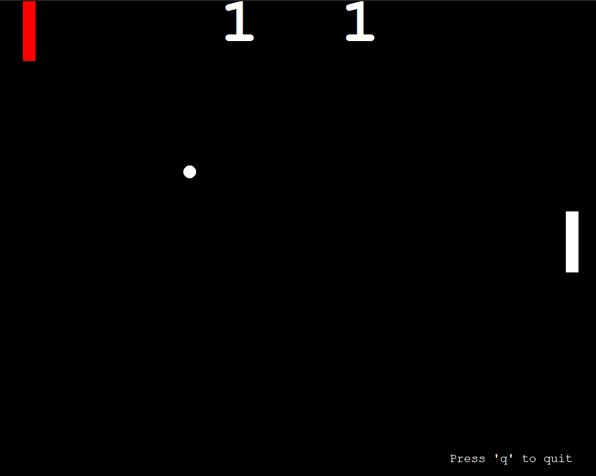

# Pong Game in Python



## Overview

This project is a basic implementation of the classic Pong game using Python and the Turtle graphics library. The game includes two paddles, a bouncing ball, and a scoring system. It's a simple and fun way to explore game development concepts in Python.

## Features

- Two-player Pong game.
- Simple paddle controls using keyboard inputs.
- Bouncing ball with collision detection.
- Scoring system to keep track of player scores.

## Getting Started

1. **Clone the repository:**

    ```bash
    git clone https://github.com/kibshh/pong_game.git
    cd pong_game
    ```

2. **Run the game:**

    ```bash
    python main.py
    ```

3. **Controls:**

   - Left Paddle: `W` (Up), `S` (Down)
   - Right Paddle: `Up Arrow` (Up), `Down Arrow` (Down)
   - Quit Game: `Q`

## Configuration

You can customize the game configuration by modifying the `config.py` file. Adjust screen dimensions, paddle colors, ball color, starting positions, and difficulty levels according to your preferences.

## Additional Information

The project includes separate modules for different components of the game, making it easy to understand and extend. Feel free to explore and modify the code to enhance or adapt the game to your liking.

Have fun playing Pong!

## License

This project is licensed under the MIT License - see the [LICENSE](LICENSE) file for details.
